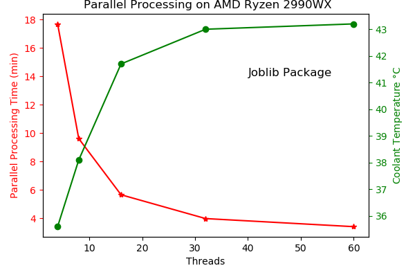

# Internal_SolarCell_Resistance-1D
Extricating the sheet resistance of transparent conductive oxide from series resistance to obtain actual internal/intrinsic of the active layer.

Simulation in Python. Main packages required: math, numpy, scipy, joblib and matplotlib.

-----
The cell is discretized into multiple cells in series.

-----
Calculates Root Mean Squared Error for a set of Intrinsic series resistances. The minimum gives the cell's internal resistance.

-----
Comparison with Rseries vs Rintrinsic.

-----
Parallel processing employed using joblib.

